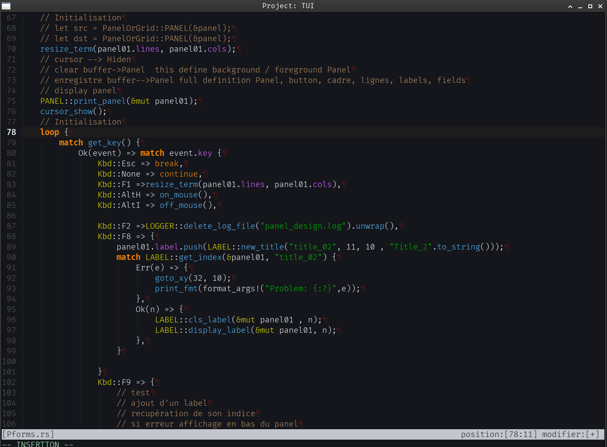
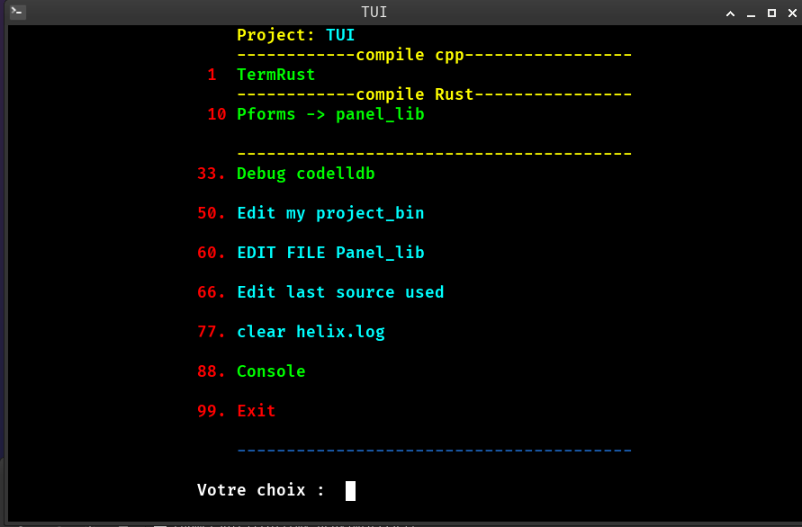

# Un terminal Rust minimaliste pour Neovim

## 📌 Introduction
**Pourquoi**  

Ce projet est né d’un besoin de contrôle total sur le comportement du terminal, notamment pour éviter les distorsions avec les touches du clavier.  
  
## 🔧 Pourquoi un terminal en Rust ?
**Avantage**  
. Sécurité mémoire (pas de segfaults, gestion propre des pointeurs).  

. Performance (rapidité d’exécution, faible latence).  

. Écosystème moderne (bibliothèques comme gtk-rs, vte-rs).  

. Intégration facile avec les outils existants (Neovim, libc, etc.).  
  
## 🏗️ Architecture du terminal
Gestion des programmes autorisés  

Seuls le programme comme nvim sont autorisés (sécurité)  
  
### Dépendances
- `gtk-rs`  
- `vte-rs`  
- `libc`  
- `once_cell`  
voir le fichier Cargo.toml  
  
### Fonctionnalités  

 | Fonctionnalité | Description |
 |----------------|-------------|
 | Gestion des programmes | Seuls `nvim` est autorisé |
 | Contrôle des touches | Désactivation des combinaisons indésirables |

## 🖥️ Intégration avec Neovim  

. Respect des tabulations : hard_tabs = true dans rustfmt.toml est fidèlement rendu.  

. Gestion des touches : Pas de conflit avec les mappings Neovim (ex: <Ctrl> + lettre).  

. Couleurs et styles : Compatible avec les thèmes Neovim (ex: FiraCode Nerd Font).  

. Stabilité : Pas de distorsion ou de comportement inattendu.  


## 🔄 Migration depuis un terminal en C  

**Pourquoi repenser le terminal en Rust ?  

. Sécurité : Éviter les erreurs de gestion mémoire (ex: malloc, free).  

. Modernité : Utiliser des bibliothèques comme gtk-rs au lieu de GTK en C.  

. Maintenabilité : Code plus lisible et modulaire.  

**Difficultés rencontrées :  
. Gestion des pointeurs : Utilisation de AtomicPtr et AtomicBool pour la thread-safety.  

. Intégration avec VTE : Adaptation des appels système (vte_terminal_spawn_sync).  

. Compatibilité : Assurer que le terminal fonctionne avec les normes (ex: . . . . .  TERM=xterm-256color).  


** Personalisation**
. Modifier TERMINAL_COLS et TERMINAL_ROWS pour ajuster la taille.  

. Changer la police dans vte_terminal_set_font.  

. Ajouter des programmes autorisés dans AUTHORIZED_PROGRAMS.  

    
  

```  
**Configuration du terminal VTE**
let terminal = vte_sys::vte_terminal_new();  

vte_sys::vte_terminal_set_font(terminal, font_desc as *const _);  

vte_sys::vte_terminal_set_size(terminal, TERMINAL_COLS, TERMINAL_ROWS);  

vte_sys::vte_terminal_set_scrollback_lines(terminal, 0);  

...
// Lancer Neovim dans le terminal
let command = CString::new("/usr/bin/nvim").unwrap();
let mut command_args = vec![command.into_raw(), ptr::null_mut()];
...
vte_sys::vte_terminal_spawn_sync(
    terminal,
    vte_sys::VTE_PTY_DEFAULT,
    wrkdir.as_ptr(),
    command_args.as_mut_ptr(),
    envp_args.as_mut_ptr(),
    glib_sys::G_SPAWN_SEARCH_PATH,
    None,
    ptr::null_mut(),
    &mut child_pid,
    ptr::null_mut(),
    ptr::null_mut(),
);  
```
  

## 🚀 Comment l’utiliser ?
creer un lanceur   
creer un fichier batch  
  
```  
#!/bin/sh
# $1 project_lib
# $2 directory
#=========================
# Call Terminal VTE
#=========================
cd $2
#projet console Rust TermNV
nohup  $HOME/.Terminal/TermNV $1 $2 > /dev/null 2>&1 &
exit 0
```  
  
  
**Prérequis :**  

Rust (version stable ou nightly).  

GTK 3 et VTE3 (pour l’émulation du terminal).  

Neovim (ou un autre éditeur compatible).  

  
```
git clone https://github.com/AS400JPLPC/term_rustt.git
cd mon_terminal_rust
cargo build --release  
```  
  
ex: .mon_terminal "Titre" "/chemin/vers/le/répertoire"
## 🎯 Conclusion
Pourquoi ce projet est utile ?  

Contrôle total sur le comportement du terminal.  

Intégration parfaite avec Neovim.  

Alternative légère à d’autres terminaux.  
  
  
<br />


<br />
<br />


<br />